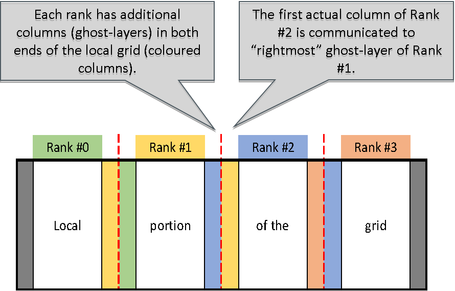

## Heat equation solver parallelized with MPI

Parallelize the whole heat equation program with MPI, by dividing the grid in
blocks of columns (for Fortran – for C substitute “row” in place of
each mention of a “column”) and assigning one column block to one
task. A domain decomposition, that is.  

The MPI tasks are able to update the grid independently everywhere else than
on the column boundaries – there the communication of a single column with the
nearest neighbor is needed. This is realized by having additional
ghost-layers that contain the boundary data of the neighboring
tasks. As the system is non-periodic; the outermost ranks communicate
with single neighbor, and the inner ranks with the two neighbors.

Implement this “halo exchange” operation into the routine exchange by
inserting the suitable MPI routines into skeleton codes (search for
"TODO"s). You may use the provided ```Makefile``` for building the code (by
typing ```make```). 

Remember to update all ghost layers at every iteration.

A schematic representation of the decomposition looks like:


